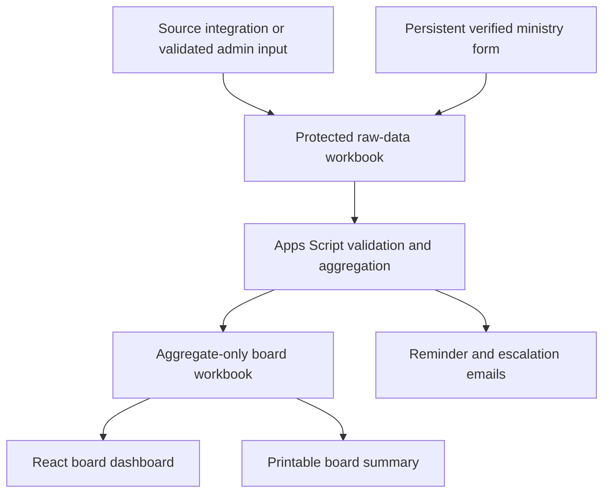

# Eagle's Ark KPI Tracker

## Product clarification and technical stack

**Status:** Proposed v1 architecture for pilot validation; revised for zero recurring technical work  
**Audience:** Eagle's Ark leadership, Dev Lead, admin staff, and implementers  
**Source:** `plan.md` — Eagle's Ark KPI Tracker Product Plan  
**Last updated:** 2026-08-18

---

## 1. The product, explained back plainly

Eagle's Ark needs one reliable place where its governing board can quickly understand whether the church is healthy and where attention is needed.

The tracker should collect attendance, membership, and ministry outcome data; turn that data into trends and a small number of clearly defined flags; show when data was not submitted; and produce a one-page board summary before each monthly meeting.

It should answer five questions in under 30 seconds:

1. Is attendance rising, stable, or falling?
2. Is membership growing, and how many members are active or lapsed?
3. Which ministries are meeting the goals they set for themselves?
4. Which ministries or metrics need attention?
5. Is any conclusion unreliable because data is missing or late?

### Important scope correction

This product is confirmed as a **non-financial church health and accountability tracker**. Giving, budgets, and other financial metrics are outside v1 and remain in the church's existing finance system.

The clearest product name is therefore **Eagle's Ark Board KPI Tracker** or **Eagle's Ark Church Health KPI Tracker**. Calling it a financial KPI tracker would create the wrong expectation. If financial KPIs are required, they should be defined as a separate scope change rather than added implicitly.

### What the tracker is not

- It is not an accounting system or replacement for the finance dashboard.
- It is not a member-facing church app.
- It is not a full church-management system.
- It is not a public leaderboard for ministries.
- It should not expose member names or individual attendance history to the board.
- It should not turn missing data into a zero or silently smooth over gaps.
- It should not impose one generic success measure on ministries with different missions.

---

## 2. v1 product contract

### Inputs

| Input | Owner | Cadence | Collection method |
| --- | --- | --- | --- |
| Online attendance check-ins by service/campus | Check-in source system | Weekly | Automated API or scheduled export; validated admin import only if no integration exists |
| Unverified online reach | Streaming/platform analytics | Weekly | Automated API or scheduled export; kept separate from attendance |
| New members and active/lapsed status | Admin/pastoral staff | Monthly | Protected admin workbook |
| Ministry goal and target | Ministry lead + leadership | At tracking-period start | Admin-approved setup form |
| Ministry result, notes, and submission status | Ministry lead | Monthly | Persistent verified Google Form or signed-link submission page; no monthly reset |

### Processing

The system should:

- classify a unique valid check-in during the scheduled service window as `live`;
- classify a unique valid check-in after the scheduled service ends and within seven days as `replay`;
- ignore duplicate submissions from the same person for the same service and count a person who checks in both live and during replay only once in the combined total;
- track anonymous stream views and page visits as `unverified_reach`, never as attendance;
- calculate four-week and year-over-year attendance trends when enough data exists;
- calculate monthly new-member counts and aggregate active/lapsed counts;
- compare each ministry's actual result with its own approved target;
- flag a ministry as **at risk** only after it misses its target for two consecutive reporting months;
- keep **reporting gap** separate from ministry performance;
- flag attendance or membership declines of 15% or more only after the comparison basis and baseline have been approved;
- preserve an explicit distinction between actual, missing, and estimated data;
- create an aggregate-only snapshot for the board dashboard.

### Outputs

| Output | Audience | Required behaviour |
| --- | --- | --- |
| KPI dashboard | Board | Aggregate cards, trends, filters, health flags, data freshness |
| Ministry submission confirmation/history | Ministry lead | Only that ministry's records |
| Admin data view | Admin/Dev Lead | Entry, corrections, validation, and individual records where authorized |
| Board summary | Board | One printable page/PDF with current position, trend, exceptions, and reporting gaps |
| Reminders | Ministry leads/admin | Nudge after missed deadline; escalate after two missed submissions |

### Non-negotiable business rules

1. **Missing is not zero.** Display “No data submitted.”
2. **Reporting is not performance.** A missed submission creates a reporting-gap flag; it does not automatically mean the ministry failed its goal.
3. **Board data is aggregate-only.** Names, personal attendance history, and lapsed-member lists must never reach the board workbook, browser payload, PDF, logs, or analytics.
4. **Ministry targets are ministry-specific.** Health is measured against an approved goal, not a universal percentage.
5. **Thresholds are provisional.** Baselines, lapsed-member rules, and alert thresholds require pilot and first-quarter validation.
6. **Every number needs context.** Show reporting period, last refresh time, comparison basis, and whether the value is actual or estimated.
7. **Attendance means verified online check-ins.** A unique person checking in during the service window is `live`; a unique person checking in after the service and within seven days is `replay`. Live is the headline attendance KPI. The combined weekly total is the deduplicated union of live and replay people. Anonymous stream views and page visits are `unverified_reach` and must never be added to attendance.

### Automation boundary: what “no manual implementation” means

The production target is **zero recurring technical implementation during normal operation**. After launch, nobody should have to edit code, reset a form, copy spreadsheet rows, rebuild a chart, run an aggregation, send reminders, assemble a PDF, or redeploy the app each month.

It is not credible to promise zero human involvement. The following activities require judgment, legal authority, or account authorization and must remain human-owned:

| Activity | Human involvement | Why it cannot be safely automated away |
| --- | --- | --- |
| Approve KPI definitions, thresholds, exemptions, and scope | One-time and when policy changes | These are governance decisions, not technical defaults |
| Create/authorize the organization-managed deployment identity and access groups | One-time; then only when people change roles | Google authorization and employment/role decisions require an accountable person |
| Enter ministry outcomes | Monthly, by ministry leads | These outcomes do not exist in another source system |
| Supply attendance or roster data when no supported integration exists | Per reporting cycle until integrated | Software cannot retrieve data from an unknown or offline source |
| Review quarantined data, pastoral exceptions, or corrections | Exception-only | The system should not guess when data is ambiguous or sensitive |
| Pilot acceptance and incident remediation | One-time or exception-only | Usability, policy approval, and failed infrastructure need accountable oversight |

Everything else in the normal monthly cycle must be automated. “No manual implementation” therefore means **zero-touch operation when inputs are valid and source systems are available**, not “no people, no setup, and no accountability.”

### Automation acceptance contract

The build is not complete until all of these are true:

- an idempotent `bootstrap` routine creates or verifies the Forms, workbooks, tabs, headers, protected ranges, folders, script properties, and installable triggers;
- one persistent form or submission page is reused across periods; the system opens/closes periods and generates ministry-specific links automatically;
- form submissions and source imports validate, deduplicate, and aggregate automatically;
- reporting periods roll over without spreadsheet or code edits;
- reminders, escalation messages, snapshot generation, PDF creation, archiving, and board delivery run on scheduled jobs;
- a failed or stale job preserves the last successful snapshot, shows a stale-data warning, and alerts the Dev Lead/admin;
- corrections are audit-logged and rebuild the affected aggregate snapshot deterministically;
- automated tests prove that forbidden person-level fields cannot enter board payloads or PDFs;
- the release pipeline builds, tests, versions, and deploys from source control without editing production in the Apps Script browser editor;
- backup copies and restore instructions are produced automatically and a restore test is completed before full rollout.

If any item above still depends on a person copying, pasting, resetting, exporting, formatting, or running a command every month, v1 has not met this contract.

---

## 3. Recommended v1 technical architecture

### Architecture decision

Use a **Google Workspace-first pilot**: a persistent verified Google Form or signed-link Apps Script form for collection, protected Google Sheets for storage, Google Apps Script for scheduled processing and the web application, and a React/TypeScript dashboard bundled into the Apps Script web app.

This keeps v1 inside tools the church already uses, avoids a separate database and paid server, and enforces the most important privacy boundary with a physically separate aggregate board workbook.

### Stack

| Layer | Recommended technology | Purpose | Why it fits v1 |
| --- | --- | --- | --- |
| Dashboard UI | React + TypeScript | Cards, filters, data states, board summary view | Matches the plan and supports reusable components |
| Build tool | Vite with a deterministic single-file Apps Script build | Bundle and inline the dashboard for Apps Script HTML Service | Removes manual copying of frontend files into the script project |
| Charts | Recharts | Attendance, membership, and ministry charts | React-native charting with enough flexibility for gap markers |
| Styling | CSS modules or a small token-based stylesheet | Accessible, printable interface | Lower maintenance than a large design system for a small app |
| Forms | Persistent Google Form for managed users; signed-link Apps Script form if external users require passwordless access | Ministry submissions and fallback admin input | Avoids monthly resets and makes respondent/period validation explicit |
| Attendance ingestion | Existing online check-in system API or scheduled export | Retrieve person/service check-in events automatically | Classifies live/replay participation and prevents duplicate attendance |
| Reach ingestion | Streaming/platform analytics API or scheduled export | Retrieve anonymous views and page visits | Shows reach without misrepresenting it as verified attendance |
| v1 storage | Two Google Sheets workbooks | Raw/admin data and aggregate/board data | Simple operations and a strong privacy boundary |
| Processing/API | Google Apps Script | Validation, aggregation, dashboard data access, email, exports | Native access to Forms, Sheets, Drive, and mail |
| Scheduling | Apps Script installable form-submit and time-driven triggers, created by `bootstrap` | Validation, reminders, aggregation, snapshots, heartbeat, and backups | No recurring trigger setup required |
| Authentication | Google Workspace access + Drive sharing for managed users; expiring signed links only when external ministry leads are approved | Board/admin/ministry access control | Avoids shared codes and validates every respondent against an allowlist |
| Configuration | Apps Script Properties | Sheet IDs, reporting dates, feature switches | Keeps configuration out of client code |
| Source control/deployment | Git + locked dependencies + CI + `clasp` + versioned Apps Script deployment | Build, test, version, and deploy on an approved branch | Avoids editing or deploying production code by hand after one-time authorization |
| Testing | Vitest for rules and schema contracts; Playwright for role/privacy and PDF smoke tests | Validate calculations, access boundaries, and full scheduled flow | Converts the recurring privacy checklist into automated release gates |
| Monitoring | Apps Script execution history + daily heartbeat + stale-snapshot and quota/error notification | Detect failed triggers, quota errors, expired links, and bad imports | Normal operation needs attention only when an exception is raised |
| Backup/recovery | Scheduled protected Drive snapshots + versioned configuration manifest | Recover workbooks, settings, and locked periods | Prevents a single workbook or account mistake from becoming unrecoverable |

### Why two workbooks, not only separate tabs

Protected tabs are useful, but a separate board workbook creates a clearer privacy boundary:

- **Admin/raw workbook:** attendance entries, member-level records, ministry contact details, targets, submissions, and processing logs.
- **Board/aggregate workbook:** counts, rates, trend points, status flags, notes approved for the board, freshness timestamps, and no person-level fields.

The board dashboard reads only the board workbook. Even if a dashboard view or API is misconfigured, the raw member rows are not in its data source.

Do not use “Publish to web” for either workbook.

---

## 4. Access model

| Role | Can access | Must not access |
| --- | --- | --- |
| Board | Dashboard, aggregate workbook, board PDF | Raw member data, ministry contact details, submission edit screens |
| Admin/pastoral | Raw workbook, correction workflow, permitted member records, aggregate outputs | System deployment credentials unless also Dev Lead |
| Dev Lead | Script project, configuration, raw and aggregate workbooks | Pastoral data outside the access leadership authorizes |
| Ministry lead | Submission form and that ministry's own approved history | Other ministries' reports and all membership data |

For the pilot, Google Drive permissions are the authorization layer for managed users. The web app deployment mode must be selected and tested explicitly: running as the accessing user preserves Drive permissions but requires user authorization; running as the deployer requires an application-level allowlist and stricter server-side checks. Do not leave this as an installer choice.

Google Forms prefilled values and ordinary shared codes are not authentication. If every ministry lead has an approved managed Workspace account, collect the signed-in email and verify it against the ministry/role roster. If external ministry leads need passwordless access, use short-lived, single-purpose signed links and validate the token, ministry, period, expiration, and reuse state on the server. Do not put member data or unrestricted write capability behind such a link.

**Deployment ownership risk:** Apps Script production deployments and installable triggers act under the deploying/creating account. Deploy and create triggers from a durable, organization-managed Workspace identity, keep a second authorized maintainer, and document redeployment/recovery so the dashboard does not depend on one person's account remaining active.

---

## 5. Data design

The plan's simplified model is a good starting point, but the implementation needs period, goal-type, freshness, and audit fields so that unlike metrics are not forced into one format.

### Raw/admin workbook tables

#### `service_occurrences`

| Field | Notes |
| --- | --- |
| `service_occurrence_id` | Stable identifier for one scheduled online service |
| `service_name` | Controlled list |
| `scheduled_start_at`, `scheduled_end_at` | Timestamp boundaries for `live` classification |
| `replay_window_end_at` | Exactly seven days after the scheduled service ends |
| `timezone` | Must match the configured reporting timezone |

#### `attendance_checkins` — admin-only source records

| Field | Notes |
| --- | --- |
| `checkin_id` | Stable source event ID; unique |
| `service_occurrence_id` | Stable identifier for one dated service/campus occurrence |
| `service_date` | ISO date |
| `service_name` | Controlled list |
| `campus_name` | Controlled list; optional for one-campus pilot |
| `person_key` | Stable source ID or pseudonymous key used for deduplication; never sent to board outputs |
| `checkin_at` | Source timestamp |
| `attendance_class` | Derived `live` or `replay`; check-ins after the replay window are not attendance |
| `source_type` | `api`, `scheduled_export`, or fallback `admin_import` |
| `ingested_at` | Processing timestamp |

Live and replay counts are `COUNT(DISTINCT person_key)` within each class and service occurrence. The combined weekly online-participation count is `COUNT(DISTINCT person_key)` across both classes and all included service occurrences, so live-plus-replay is never calculated by simply adding the two counts. If the source cannot provide a stable person key, the system cannot reliably prevent duplicates and the source integration is not acceptable for the confirmed metric.

#### `unverified_reach`

| Field | Notes |
| --- | --- |
| `service_occurrence_id` | Associated scheduled service |
| `platform` | Streaming or web platform |
| `metric_key` | `stream_views`, `page_visits`, or another approved anonymous reach measure |
| `metric_value` | Non-negative platform-reported value |
| `captured_at` | Snapshot timestamp |

Unverified reach contains no `person_key`, is not deduplicated against attendance, and must be displayed in a separate dashboard section.

#### `members` — admin/pastoral only

| Field | Notes |
| --- | --- |
| `member_id` | Internal ID; never sent to board output |
| `join_date` | Used for monthly new-member count |
| `last_attended_date` | Used only after lapsed definition is approved |
| `status` | `active`, `lapsed`, or another approved state |
| `status_effective_date` | Makes status history auditable |

#### `ministries`

| Field | Notes |
| --- | --- |
| `ministry_id` | Stable ID |
| `name` | Display name |
| `owner_contact` | Admin-only |
| `active` | Prevents deleted-history problems |

#### `ministry_goals`

| Field | Notes |
| --- | --- |
| `goal_id` | Stable ID |
| `ministry_id` | Foreign key |
| `period_start`, `period_end` | Goal validity |
| `description` | Plain-language outcome |
| `goal_type` | `number`, `percentage`, or `milestone` |
| `direction` | `at_least`, `at_most`, or `complete` |
| `target_value` | Nullable for milestone goals |
| `unit` | People, events, visits, percent, etc. |
| `approved_by`, `approved_at` | Governance trail |

#### `ministry_reports`

| Field | Notes |
| --- | --- |
| `report_id`, `ministry_id`, `goal_id` | Stable links |
| `reporting_month` | Unique with ministry/goal |
| `actual_value` | Nullable when milestone/text report |
| `milestone_complete` | Nullable boolean |
| `notes` | Admin-reviewed before board exposure |
| `submitted_at`, `submitted_flag` | Distinguishes late/missing from zero |

#### `processing_runs`

Record run time, input range/version, result, warning count, and error message. Do not copy personal data into logs.

#### `correction_log`

Record the changed record ID, changed fields, reason, actor, timestamp, affected periods, and rebuild result. Store field names and safe before/after values only; never duplicate pastoral notes into the log.

#### `access_roster`

Record managed user email or approved signed-link recipient, role, ministry scope, active dates, and last access review. Access changes must be effective-dated so a removed user cannot continue to submit or view history.

### Aggregate board workbook tables

- `metric_snapshots(period, metric_key, scope, actual, comparison, delta_pct, data_state, refreshed_at)`
- `ministry_health(period, ministry_id, display_name, status, target_summary, actual_summary, reporting_state)`
- `alerts(period, alert_type, scope, severity, explanation, data_state)`
- `board_summary(period, headline, value, trend, context, display_order)`
- `snapshot_manifest(period, status, source_run_id, locked_at, pdf_file_id, checksum)`

Allowed `data_state` values should be explicit: `actual`, `missing`, `partial`, and `estimated`. The pilot should avoid estimation unless leadership approves a specific method.

---

## 6. KPI calculation rules

### Rules confirmed by the source plan

| Metric/state | v1 rule |
| --- | --- |
| Live attendance — headline KPI | Distinct valid people checking in during the scheduled service window |
| Replay attendance | Distinct valid people checking in after the scheduled service and within seven days |
| Combined weekly online participants | Distinct people across live and replay check-ins for the reporting week; each person counts once in the combined number |
| Unverified reach | Anonymous stream views/page visits shown separately; never added to attendance |
| New members | Count of approved member records whose join date falls in the month |
| Ministry on track | Current result meets the ministry's own approved target |
| Ministry at risk | Target missed in two consecutive reporting months |
| Reporting gap | No submission for the required period; escalate after two consecutive misses |
| Missing data display | “No data submitted,” never zero |
| Board privacy | Aggregate values only |

### Rules that still need approval

| Decision | Recommended pilot definition | Why approval is needed |
| --- | --- | --- |
| Active vs. lapsed | Leadership defines the absence window and exemptions before automation | The plan does not specify the time threshold or pastoral exceptions |
| Attendance 15% alert | Apply to the live-attendance headline KPI; compare the latest four-week average with the same service baseline and use YoY when a comparable prior-year period exists | “15% below” is incomplete without an approved comparison basis |
| Minimum data for alert | Suppress the alert and show `partial` when the current comparison window has material missing data | A decline cannot be separated from a reporting gap otherwise |
| “Stalled” ministry | Do not implement until leadership defines it separately from at-risk and missing | The plan names the status but does not define it |
| Estimated trend segments | Prefer no interpolation in v1; if added, label estimates and render dotted segments | Estimation can imply certainty that is not present |

All calculation functions should return both a value/status and a human-readable explanation, for example: “At risk: target missed in May and June.” The same explanation should appear in the dashboard, board summary, and tests.

---

## 7. Monthly operating flow

1. **Day 1 — automated:** Open the new reporting period, create expiring ministry-specific links where needed, and distribute invitations.
2. **Day 5 — automated:** Send reminders only to ministries without a valid submission.
3. **Day 6 — automated with exception review:** Validate attendance, membership aggregates, duplicates, respondent identity, and board-safe notes. Admin acts only on quarantined exceptions; a green run needs no action.
4. **Day 7 — automated:** Fail closed when validation/privacy checks fail; otherwise lock the monthly aggregate snapshot, create the one-page PDF, archive it, and deliver it to the approved board destination.
5. **After the board meeting — human policy action only:** Record approved definition or threshold changes with an effective date; never rewrite historical results silently.

The dashboard should show the latest completed/locked period by default, with a clear “preliminary” badge if the current period is still open. The script, workbook, and reporting timezone must be identical and stored in configuration so month-end and daylight-saving boundaries do not shift records.

---

## 8. Dashboard requirements

### Board home

- Latest reporting period and last refresh time
- Unique live attendance and four-week trend
- Replay attendance and deduplicated combined weekly online participants
- Unverified reach in a visibly separate, non-attendance section
- New members and aggregate active/lapsed counts
- Ministries on track / at risk / reporting gap
- Active alerts with plain-language explanations
- Data completeness indicator

### Detail views

- Live, replay, and deduplicated combined participation by service and date range
- Unverified reach by platform, never stacked into attendance charts
- Membership aggregate trend
- Ministry performance against each ministry's own goal
- Reporting completeness by ministry and month

### Visual and accessibility rules

- Never rely on red/green alone; pair colour with icon and text.
- Show chart gaps, not connected lines, for missing values.
- Display the denominator and comparison period for percentages.
- Use print-specific styles so the board summary fits one page.
- Keep sensitive notes out of tooltips, browser storage, URLs, and client logs.

---

## 9. Automation and failure handling

### Scheduled jobs

| Job | Timing | Failure behaviour |
| --- | --- | --- |
| Validate/import form responses | On submission or scheduled batch | Quarantine invalid row and notify admin |
| Refresh aggregate workbook | After input and nightly | Keep last successful snapshot; mark refresh stale |
| Open period and distribute links | Day 1 | Alert admin; retry safely without issuing duplicate active links |
| First reminder | Day 5 | Log delivery result; retry transient failures and provide an exception-only resend action |
| Escalation | After two missed reporting periods | Notify Dev Lead/admin; do not mark ministry performance failed |
| Board snapshot, PDF, archive, and delivery | Day 7 after validation | Fail closed if validation/privacy checks fail |
| Health check and backup | Daily/nightly | Alert on stale triggers, failed backup, ownership loss, or approaching quota |

### Guardrails

- Use idempotent jobs so rerunning a trigger does not duplicate rows or emails.
- Use unique keys for service/date and ministry/month.
- Validate allowed service, campus, ministry, unit, and status values.
- Back off on transient API failures and notify the Dev Lead after the final retry.
- Check remaining email quota before bulk reminders.
- Surface a stale-data banner when the last successful refresh is outside the expected window.
- Use locks around submission processing and snapshot creation so concurrent executions cannot create duplicates.
- Recompute an affected period from immutable raw records after a correction; never patch aggregate cells by hand.
- Keep an outbox/delivery ledger so retries cannot send the same reminder or board packet twice.
- Keep secrets and deployment credentials out of Sheets, client bundles, and source control.

### One-time provisioning and release automation

The repository must contain:

- a machine-readable environment manifest containing non-secret names, timezone, reporting schedule, folder names, and required groups;
- an idempotent `bootstrap`/`verify` command that creates or checks Forms, workbooks, schemas, protected ranges, folders, properties, triggers, test data, and monitoring recipients;
- locked dependency versions and scripts for linting, type checking, unit tests, end-to-end tests, production build, and deployment;
- a CI workflow that blocks deployment unless calculations, forbidden-field contracts, role tests, and PDF smoke tests pass;
- an automated versioned deployment and a documented rollback to the last known-good deployment;
- a post-deploy smoke test that verifies dashboard freshness, an aggregate-only payload, and a successful test snapshot.

The unavoidable one-time steps are creation/authorization of the managed Google identity, approval of OAuth scopes, connection of CI credentials, and approval of access groups. These must appear in the launch checklist, but they are not recurring implementation.

---

## 10. Testing and acceptance criteria

### Automated business-rule tests

- One missed target does not create `at_risk`; two consecutive misses do.
- A missed submission creates `reporting_gap`, not a zero and not `at_risk` by itself.
- A target met after a missed month does not accidentally reuse stale data.
- A 15% alert uses the approved comparison basis and handles equality consistently.
- Missing current-period data suppresses misleading decline alerts.
- Member-level fields are absent from every board-output schema.
- Duplicate submissions resolve according to an explicit admin-approved rule.
- Check-ins at the service-window and seven-day boundaries receive the expected classification.
- A person who checks in live and during replay appears once in the combined weekly count.
- Unverified stream/page metrics never enter an attendance calculation.

### Role/privacy acceptance tests

- A board user cannot open the raw workbook.
- A ministry lead cannot view another ministry's history.
- A board dashboard network response contains no names, email addresses, member IDs, or last-attended dates.
- The board PDF contains aggregate data only.
- Revoking a user's Workspace access immediately blocks their next session.
- Every server endpoint denies an unknown role, inactive user, expired period, or out-of-scope ministry.
- A static schema/serialization test fails the build if any forbidden person-level field is added to a board response.
- A seeded end-to-end run opens a period, accepts valid input, rejects invalid identity, sends one reminder, locks one snapshot, and creates one aggregate-only PDF.

### Product acceptance targets

- A board member understands the current position in under 30 seconds.
- A ministry lead submits a monthly report in under five minutes.
- No manual chart building is required before a meeting.
- Missing and late data are visible and correctly labelled.
- At least one seeded at-risk scenario is correctly flagged in the pilot test.

Human pilot review is still required for wording, usability, pastoral appropriateness, and board comprehension. It is an acceptance decision, not a monthly technical procedure.

---

## 11. Delivery plan

### Weekend prototype

**Day 1 morning**

- Confirm definitions that block implementation.
- Implement the idempotent bootstrap/verify routine for workbooks, Forms, protection, folders, configuration, and triggers.
- Configure the managed deployment identity, access groups, CI authorization, and recovery maintainer.
- Seed fictional test data; do not use real member data during UI development.

**Day 1 afternoon**

- Build dashboard layout and missing-data states.
- Implement pure calculation functions and tests.
- Add printable summary route.
- Add forbidden-field schema contracts and access-denial tests.

**Day 2 morning**

- Connect Apps Script to the aggregate workbook.
- Implement scheduled aggregation, period rollover, freshness metadata, backup, and heartbeat.
- Automate board/admin/ministry role tests.

**Day 2 afternoon**

- Add idempotent reminders, delivery ledger, alert explanations, error notification, and automated PDF/archive workflow.
- Run automated privacy, restore, and full monthly-cycle scenarios.
- Create a short operations runbook for the Dev Lead.

### Pilot and rollout

- Weeks 1–4: two ministries plus attendance/membership.
- End of pilot: validate form friction, active/lapsed definition, alert comparison, and board usefulness.
- Month 2: onboard other ministries only after pilot fixes.
- End of Quarter 1: approve or revise baselines and status definitions; decide whether to keep Sheets or migrate.

---

## 12. When to move beyond Google Sheets

Do not migrate simply because a database is more conventional. Migrate when the pilot proves a concrete need, such as:

- row-level permissions are required for many ministry users;
- Forms and separate workbooks become difficult to administer safely;
- audit/version requirements exceed Drive and processing-run history;
- data volume or dashboard latency becomes unacceptable;
- integrations require reliable APIs and background queues;
- concurrent edits cause data-quality problems;
- the tracker expands into person-level workflows or financial data.

The v2 target should be a managed PostgreSQL database, server-side role-based authorization, and the same React/TypeScript interface. Keep the v1 aggregate-output contract so the UI can migrate without redefining every KPI.

---

## 13. Knowledge gaps and decisions required before coding

The remaining gaps are not primarily gaps in programming knowledge. They are missing facts about church policy, source systems, identity, and governance. Until they are answered, an implementer would have to guess—and those guesses could produce misleading KPIs or unsafe access.

### Confirmed decisions — 2026-08-18

| Decision | Confirmed definition |
| --- | --- |
| Product scope | Non-financial church health and accountability tracker; giving, budgets, and other financial KPIs are excluded from v1 |
| Attendance source | People recorded through the approved online check-in system |
| Live attendee | A unique person who checks in during the scheduled service window |
| Replay attendee | A unique person who checks in after the live service and within seven days |
| Combined weekly online participants | Deduplicated union of live and replay people; someone appearing in both counts once |
| Unverified reach | Stream views and page visits without a verified check-in; tracked separately and never treated as attendance |
| Headline KPI | Unique live check-ins per service |

### Unresolved decisions

| Priority | Decision owner | Question |
| --- | --- | --- |
| Before pilot | Church leadership | Which final product name should be used? |
| Blocker | Pastoral/admin leadership | What exact rule makes a member active or lapsed, including exemptions? |
| Blocker | Board + Dev Lead | What is the comparison basis for the 15% attendance/membership alert? |
| Blocker | Workspace admin | Which managed accounts/groups belong to board, admin, Dev Lead, and pilot ministry leads, and are any ministry leads outside the Workspace domain? |
| Blocker | Admin/Dev Lead | Which online check-in and membership systems are used, and do they provide an API or scheduled export, stable person/service IDs, and change history? |
| Before pilot | Admin/board | How will children, guests, or people without a stable account receive a unique `person_key` without increasing check-in friction? |
| Blocker for fully automated ingestion | Data-system owner | Can the source integration be authorized and tested? If not, who owns the validated import/entry step? |
| Blocker | Leadership/privacy owner | What member fields may be digitized, how long are they retained, when are they deleted, and who can correct or export them? |
| Before pilot | Board | Should current/open periods be visible or only locked monthly snapshots? |
| Before pilot | Leadership | Is “stalled” needed, and if so, how is it different from at-risk and reporting gap? |
| Before pilot | Admin | Which timezone, reporting cutoff, late-submission window, meeting date, holidays, and reminder sender/reply-to apply? |
| Before pilot | Leadership | May ministry notes appear automatically on the board summary, or do they require admin approval/redaction? |
| Before pilot | Workspace admin | Will the web app execute as the accessing user or deployer, and what OAuth/access-group model is approved? |
| Before pilot | Dev Lead | What repository/CI platform, production branch, deployment approver, backup location, retention period, and recovery maintainer will be used? |
| Before rollout | Board/admin | What is the correction policy after a period is locked, and should a corrected PDF replace or supplement the original? |
| Before rollout | Board | How should the dashboard/PDF be delivered, who receives it, and is automatic distribution permitted after validation passes? |

### Highest-risk assumptions to validate first

1. The online check-in system provides stable person and service-occurrence identifiers; without them, duplicates cannot be removed reliably.
2. Attendance and membership records can be joined reliably enough to derive “active” and “lapsed.”
3. The existing source system supports automation; otherwise recurring input/import remains manual by necessity.
4. All viewers and submitters can be authenticated without relying on editable prefilled fields or shared codes.
5. Leadership has authority to digitize, retain, aggregate, and expose the proposed member data.
6. A two-day prototype is enough for a demo, not for production privacy, recovery, automated deployment, and full-cycle acceptance.

---

## 14. Recommended decision summary

- **Build:** a confirmed non-financial board accountability dashboard.
- **Count attendance as:** unique live check-ins per service as the headline; replay check-ins within seven days as a separate measure; deduplicate people across live and replay in the combined weekly total.
- **Keep separate:** anonymous stream views and page visits as unverified reach, never attendance.
- **Use for v1:** React, TypeScript, Recharts, the existing online check-in source, Google Forms, two Google Sheets workbooks, and Google Apps Script.
- **Protect:** raw member data with a separate admin workbook; board outputs are aggregate-only.
- **Automate:** provisioning, period rollover, validation, aggregation, reminders, stale-data warnings, backups, correction rebuilds, monthly board snapshot, PDF/archive delivery, tests, and deployment.
- **Keep human:** policy approval, source data that has no integration, ministry outcome submission, exception review, access changes, pilot acceptance, and incident response.
- **Delay:** financial data, a custom database, mobile app, public access, broad integrations, and undefined statuses.
- **Validate in pilot:** lapsed-member definition, 15% comparison basis, ministry goal design, and whether the board finds the dashboard more useful than an improved spreadsheet.

---

## 15. Technical references

- [React documentation](https://react.dev/)
- [Vite documentation](https://vite.dev/guide/)
- [Recharts documentation](https://recharts.org/en-US/)
- [Google Apps Script deployments](https://developers.google.com/apps-script/concepts/deployments)
- [Google Apps Script web apps and execution identity](https://developers.google.com/apps-script/guides/web)
- [Google Apps Script installable triggers](https://developers.google.com/apps-script/guides/triggers/installable)
- [Google Forms Apps Script reference](https://developers.google.com/apps-script/reference/forms/form)
- [Google Apps Script PDF automation sample](https://developers.google.com/apps-script/samples/automations/generate-pdfs)
- [Google Apps Script quotas](https://developers.google.com/apps-script/guides/services/quotas)
- [Google Sheets API usage limits](https://developers.google.com/workspace/sheets/api/limits)
- [`clasp` — Apps Script command-line tool](https://github.com/google/clasp)

Because Google service quotas can change, confirm current limits during pilot setup and monitor trigger executions rather than treating a copied quota number as permanent.
